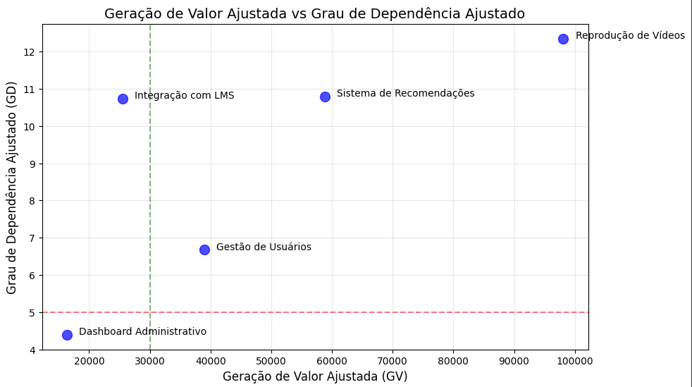

# Metodologia para Cálculo de Grau de Dependência (GD) e Geração de Valor (GV) em Módulos de Software

## Introdução

O cálculo do **Grau de Dependência (GD)** e **Geração de Valor (GV)** ajuda na **priorização de módulos** durante o desenvolvimento de um sistema de software. Antes de começar a implementação, é possível estimar essas métricas para ajudar a **decidir quais módulos devem ser desenvolvidos primeiro** com base em sua complexidade e impacto estratégico no negócio.

---

## 1. **Grau de Dependência (GD)** - **Projeção para Módulos em Desenvolvimento**

O **Grau de Dependência (GD)** é uma medida da **complexidade técnica** e das **interdependências** que um módulo terá com outros módulos do sistema.

### Componentes:
- **Dependências Previsíveis (D)**: Quantificação das dependências que o módulo terá com outros módulos no sistema.
  
- **Centralidade Estimada (C)**: A centralidade de um módulo em relação aos outros módulos do sistema. Pontuação de 1 a 10, onde **10** significa que o módulo é altamente central e **1** significa que é independente.
  
- **Impacto Estimado de Modificação (I)**: Estimativa do impacto de modificações no módulo para outros módulos do sistema. Pontuação de 1 a 10, onde **10** significa um grande impacto e **1** significa baixo impacto.

### Fórmula para Cálculo do GD (Projeção):
```math
GD = {(D + (C.10) + I)}/ 3
```

Onde:
- **D** = Dependências Previsíveis
- **C** = Centralidade Estimada (1 a 10)
- **I** = Impacto Estimado de Modificação (1 a 10)

#### O que isso simboliza:
- **Baixo GD**: Módulos simples de desenvolver, com poucas dependências e impacto limitado.
- **Alto GD**: Módulos complexos, interdependentes e com grande risco em mudanças.

---

## 2. **Geração de Valor (GV)** - **Projeção para Módulos em Desenvolvimento**

A **Geração de Valor (GV)** é uma medida de **quanto valor o módulo trará para o negócio** com base no impacto estratégico, uso esperado e facilidade de expansão.

### Componentes:
- **Impacto Estratégico Estimado (B)**: Estimativa do impacto do módulo no negócio (crescimento da receita, eficiência, experiência do usuário). Pontuação de 1 a 10, onde **10** indica alto impacto e **1** baixo impacto.
  
- **Uso Esperado (U)**: Estimativa da taxa de adoção ou utilização do módulo pelos usuários. Pontuação de 0 a 1, onde **1** significa uso universal e **0** significa uso limitado.
  
- **Facilidade de Expansão (F)**: Avaliação da facilidade de evolução do módulo no futuro. Pontuação de 0 a 1, onde **1** significa fácil de expandir e **0** significa difícil de expandir.

### Fórmula para Cálculo do GV (Projeção):
```math
GV = B(U + F)
```

Onde:
- **B** = Impacto Estratégico Estimado (1 a 10)
- **U** = Uso Esperado (0 a 1)
- **F** = Facilidade de Expansão (0 a 1)

#### O que isso simboliza:
- **Baixo GV**: Módulos com baixo valor estratégico, uso limitado ou difícil de evoluir.
- **Alto GV**: Módulos com grande valor para o negócio, alto uso esperado e facilidade de expansão.

---

## 3. **Prioridade de Desenvolvimento com Base no GD e GV**

Com os cálculos de **GD** e **GV**, podemos determinar a **prioridade** de desenvolvimento dos módulos.

### Como Priorizar:
- **Módulos com Alto GD e Alto GV**: Desenvolver primeiro. São críticos para o sucesso do sistema, apesar da complexidade.
  
- **Módulos com Baixo GD e Alto GV**: Desenvolver a seguir. Têm grande valor e são menos complexos.
  
- **Módulos com Alto GD e Baixo GV**: Desenvolver depois. Embora complexos, têm baixo valor imediato.
  
- **Módulos com Baixo GD e Baixo GV**: Desenvolver por último ou considerar não implementar.

---

## 4. **Visualização e Estratégia de Implementação**

- **Gráfico de Dispersão**: Para visualizar a priorização, um gráfico de dispersão pode ser usado, onde:
  - O eixo **X** representa o **GV** (quanto maior, maior a geração de valor).
  - O eixo **Y** representa o **GD** (quanto maior, maior a complexidade e dependência).

---

## 5. **Conclusão**

Esta metodologia permite que você faça **estimativas** antes de começar o desenvolvimento real dos módulos, ajudando a priorizar aqueles que têm maior impacto para o negócio e que podem ser desenvolvidos com uma complexidade gerenciável. Assim, você pode alocar recursos de forma eficiente, começando com os módulos mais críticos e com maior potencial de valor.

---

## 6. Exemplo de caso para uma plataforma de streaming


